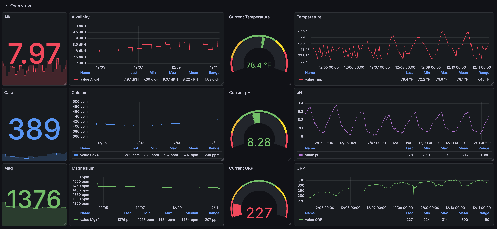

# apex_datalog
Export and Visualize Neptune Apex XML Datalog with Grafana

## Application
1. Export the Apex datalog once a day at 11:59pm and store data into InfluxDB
2. Visualize the Apex datalog with Grafana dashboard
3. Deploy application via Docker container

## Installation
0. Find Apex IP Address via Ping
```
$ ping the_sanctuary.local # <YOUR_APEX_NAME>
PING the_sanctuary.local (192.168.1.131): 56 data bytes
64 bytes from 192.168.1.131: icmp_seq=0 ttl=64 time=0.735 ms
64 bytes from 192.168.1.131: icmp_seq=1 ttl=64 time=0.690 ms
```
1. Replace `docker-compose.yml` fields with your own
```
      DOCKER_INFLUXDB_INIT_USERNAME: admin # TODO: change
      DOCKER_INFLUXDB_INIT_PASSWORD: your_admin_password # TODO: change
      DOCKER_INFLUXDB_INIT_ORG: Ugreen_Apex
      DOCKER_INFLUXDB_INIT_BUCKET: apex_datalog
      DOCKER_INFLUXDB_INIT_ADMIN_TOKEN: your_long_secure_token 
      ...
      # Python Script Configuration (Matches variables in apex_loader.py)
      APEX_HOST: http://the_sanctuary.local # <--- CHANGE THIS TO YOUR APEX IP
      ...
      # InfluxDB Connection (Uses same values as the influxdb service above)
      DOCKER_INFLUXDB_INIT_ORG: Ugreen_Apex
      DOCKER_INFLUXDB_INIT_BUCKET: apex_datalog
      DOCKER_INFLUXDB_INIT_ADMIN_TOKEN: your_long_secure_token
      ...      
      - GF_SECURITY_ADMIN_USER=admin # TODO: change
      - GF_SECURITY_ADMIN_PASSWORD=your_admin_password # TODO: change
```
2. Move files to you machine of choice
- Preferably to docker folder
3. Build and Run Docker Images
- The docker containers will run on your machines in an isolated environment
- Keep note of what this machines IP Address is, will be used later `<MACHINE_IP>`.
```
docker compose up -d --build
```

## Dashboards
1. InfluxDB
- This webapp will store the datalogs pulled from Apex
```
http://<MACHINE_IP>:8086/
```
2. Grafana
- This webapp will visualize the datalogs stored in InfluxDB
```
http://<MACHINE_IP>:3000/
```

### Grafana Dashboard
You can find a grafana dashboard template to use in `grafana/dashboard.json` and import to Grafana to get something that should look like this:

